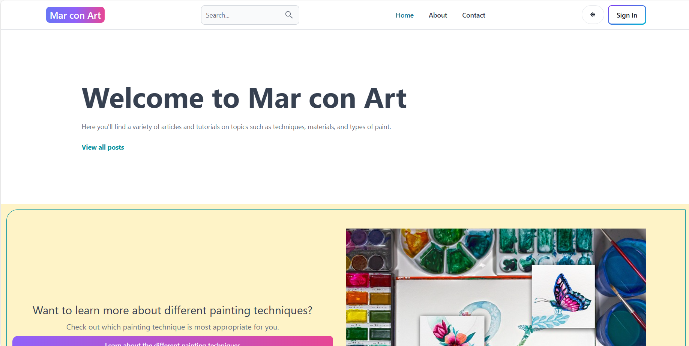

# Blog "Mar con Art"



Proyecto de un Blog de Arte 👩🏼‍🎨🖌️, donde muestro mis trabajos de arte mediante post (algunos trabajos hechos en 2 horas referidos a colección verano, Navidad). En este blog, los usuarios pueden acceder para visionar los post, deben darse de alta para poner comentarios y dar like a aquellos que les gusten, además, pueden modificar su comentario, quitar el like, pueden modificar su perfil, pero no elimnarlo. Por otro lado el blog, tiene un titular principal que es el owner del blog y es el unico que puede colgar post, ampliarlo como articulos, editar, eliminar los comentarios así como cuentas de usuarios. Disfruta de la experiencia...y si te gustan dale 👍🏼. 

## Logo del Owner de la web


## Tabla de Contenidos

- [Instalación](#instalación)
- [Uso](#uso)
- [Desarrolladores](#desarrolladores)
- [Licencia](#licencia)

## Estado del Proyecto
🚧El blog esta en continuo cambio, debido a que se iran susbiendo los trabajos de arte 🚧.

## Instalación
💻

Al instalarse el proyecto en la consola se deben tener en cuenta las siguientes indicaciones: <br>
- Se debe instalar Node.js en el ordenador: ```npm install```
- Dentro de la carpeta **client** debemos escribir en la terminal:
```npm run dev```
- Dentro de la carpeta **server** debemos escribir en la terminal: ```nodemon indexjs```

- Ambos códigos deben estar en diferentes terminales corriendo para poder ser usado el proyecto.

Para desarrollar el blog instalé las siguientes dependencias:
        
- ```Frontend```: <br>

    👓 npm i

    👓 npx tailwindcss init -p

    👓 npm install -D tailwindcss postcss autoprefixer

    👓 npm i react -router-dom

    👓 npm i react -icons

    👓 npm i flowbite-react 

    👓 npm install @reduxjs/toolkit react-redux

    👓 npm i redux -persit

    👓 npm install -- save-react-circular-progressbar

    👓 npm install react -quill--save

    👓 npm install --save-dev tailwind scroll

    👓 npm install -D @ tailwindcss/line-clamp

    👓 npm i moment

    👓  npm install --save moment react-moment

    👓 npm install validator

    👓 npm install -D cypress

    👓 npm i mongoose

    👓 npm i dotenv

    👓 npm i bcrytjs

       
- ```Backend```

    👓 npm create vite@latest

    👓 npm i express

    👓 node api/index.js

    👓 npm i nodemon

    👓 npm run dev

    👓 npm i jsonwebtoken

    👓 npm cookie- parser

    👓 npm install express-rate-limit
   

## Uso

Puedes navegar por la web, para visualizar los artíulos/ post que estan incluidos en el blog, pero sin registrarte y logarte, no vas a poder escribir comentarios ni LIkes en los post. Si precisas tener la pagina en modo oscuro, puedes darle al botón con el logo de sol del header y reducimos la huella de carbono para el planeta 🥰 (Green Digital Skills). 

## Créditos

### Desarrolladora:

- Mar [Linkedin](https://www.linkedin.com/in/mar-prieto-garcia/)


## Tecnologías utilizadas

 
 
 


<br>
- Tailwindcss


## Metodologías Ágiles
- <a href="https://trello.com/invite/b/5NHxzk9O/ATTI9a0faced8315a0d06eb5c07215858453DC4CA1E2/proyecto-prefinal-todo-list"> Trello </a> </br> 
- <a href="https://www.figma.com/file/YHMOeiH9MpiViY9iGK4o4g/BLOG_Mar-con-Art?type=design&node-id=4%3A3&mode=design&t=wlI0nDrb7GGJOhy6-1"> Figma </a> </br>
- <a href="https://github.com/MarPrieto7/blog-mar">GitHub</a> </br>

- <a href="https://blog-mar.onrender.com">Deploy</a> </br>

## Licencia

Este proyecto está bajo la Licencia [CCO](LICENSE).

Las fuentes utilizadas en este proyecto estan sujetas a licencia SIL con Copyright &copy; 2014, Indian Type Foundry (info@indiantypefoundry.com)

## Test 

Se han realizado test para Home (2), Footer, Postpage, Search, y SignIn con resultado Passed. 

 <a href="https://www.canva.com/design/DAGDmlVjwkU/4jZN3dzQHIob9pue9YbVBQ/edit?utm_content=DAGDmlVjwkU&utm_campaign=designshare&utm_medium=link2&utm_source=sharebutton">Ver resultados</a> </br>